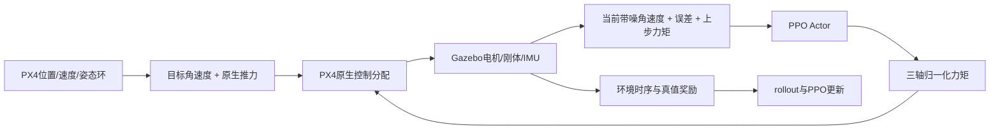

# 训练项目架构

本次重构以`e734448`保存的实现为行为基线。训练进程继续使用原工作目录；重构在独立Git worktree中完成，不修改运行中的Gazebo资产、PX4二进制或检查点。

## 配置与入口

- `rate_rl/defaults.py`：当前公开训练配方；单环境、4096采样、batch2048、KL学习率范围、奖励和噪声默认值。
- `scripts/train_rate_only.py`：兼容原命令行的公开入口；支持无副作用的`--dry-run`预览。
- `rate_rl/launcher.py`：解析并验证运行配置、生成底层训练命令；配置与进程启动分开。
- `rate_rl/run_manager.py`：管理本次训练子进程、日志发布器和`job.json`生命周期。
- `rate_rl/train.py`与`rate_rl/training/`：训练参数构造、环境工厂、监控回调、元数据和模型恢复；主入口保留契约校验和训练编排。

## 控制、奖励与优化



`RateControlEnv`负责动作执行、同步反馈、目标更新与回合状态；`rate_rl/rewards.py`中的纯函数负责连续项及结算，不执行I/O。Actor只看9维观测，仿真真值用于奖励及诊断。推力和电机分配仍由原生PX4完成。

`adaptive_ppo.py`独立负责解析KL、学习率调节与优化；`ppo_schedule.py`只应用阶段设置。当前两阶段数值相同，历史阶段名仍可读取。单环境和可选并行协调器分别管理rollout、检查点和随机状态。

## 兼容边界

- 保留`rate_rl.env.TaskConfig`、策略类和公开训练命令路径，避免破坏历史pickle/cloudpickle引用。
- 奖励、动作及环境契约继续严格校验；允许的显式迁移不因重构扩大范围。
- 公共默认配方和历史`TaskConfig`默认值职责不同。旧配置必须按原有字段解释，不能静默套用新配方。
- Gazebo/PX4桥接、时钟同步、电机动态及IMU噪声注入位置不变。
- `runs/`、模型、日志、`runtime*.json`、运行时仿真资产继续排除在Git外。

## 验证与运行边界

纯单元及回归测试不启动真实仿真：

```bash
python -m pytest -q
python scripts/train_rate_only.py --run runs/review --steps 4096 --dry-run
```

奖励对照测试覆盖固定动作序列、噪声与真值的区别、力矩变化、饱和、提前失败、终点结算和旧模式兼容。模型兼容性另用既有检查点离线比较权重、动作和值函数输出。实际SITL接口验证必须显式运行诊断脚本；重构测试通过不代表策略收敛或具备实机飞行能力。

## 本次验证记录

- 重构前基线：167项通过，7项失败。7项均为已批准的平滑权重翻倍和3500剩余时间惩罚变更后，旧测试仍期待旧值；测试期望已按实际基线实现修正。
- 重构后最终完整回归：255项通过，包含启动器实例范围、停止状态和清理失败测试。
- 固定转移对照：6组重构前记录覆盖完整观测、奖励、结束标志、诊断及契约，重构后逐项一致。
- 实际1,757,184步检查点离线对照：网络权重一致，固定128组9维输入的确定性动作及价值输出逐字节一致；步数、学习率和13组优化器状态保留。
- `--dry-run`展示的单环境/4096采样/batch2048/10epochs/20.48秒/2倍平滑配置与当前约定一致，预览没有创建运行目录。
- 当前平滑权重翻倍后的检查点，其奖励契约与真实仿真资产契约也完全匹配。
- 未重建PX4/Gazebo，未启动真实仿真评估或新训练，未更改原工作目录运行中的任务。Python回归不能替代全新机器上的SITL构建验证。
